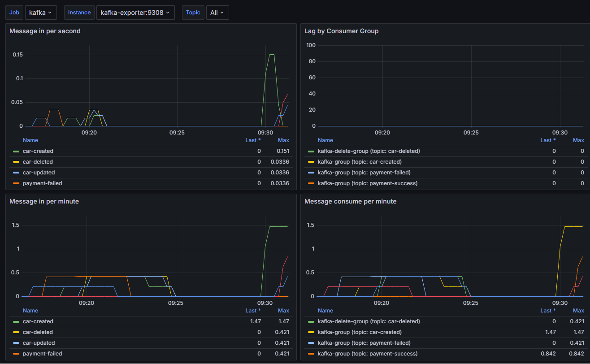
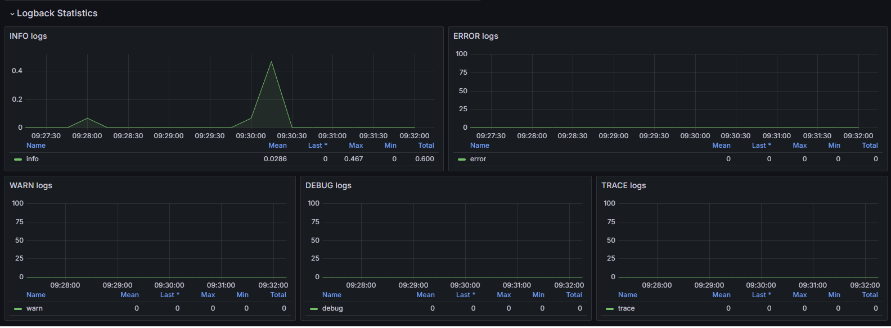
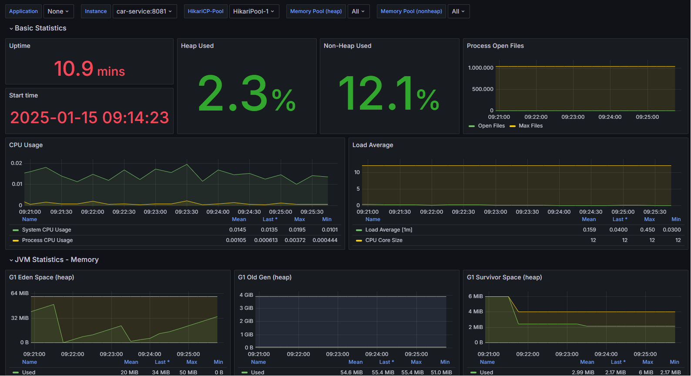
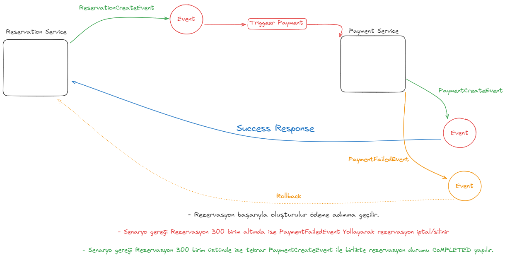
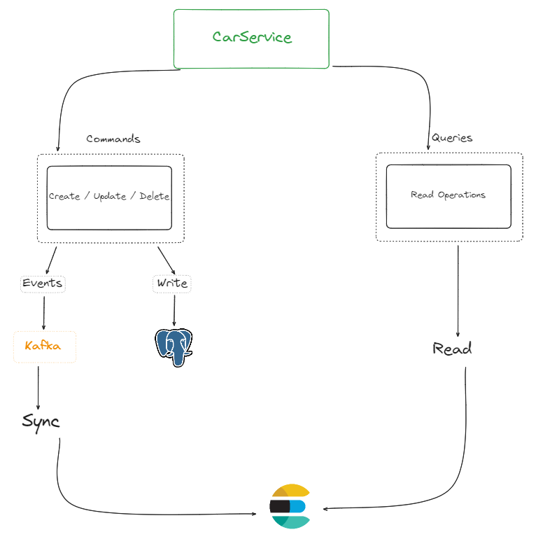

# Reservation Service with CQRS, Saga Pattern & Kafka

Bu proje, **CQRS** (Command Query Responsibility Segregation) tasarım deseni, **Saga Pattern** ve **Kafka** tabanlı event-driven mimari kullanılarak geliştirilmiştir. Sistem, araç rezervasyonları üzerinde işlem yaparak, rezervasyonları yönetir ve farklı senaryolara göre durum güncellemeleri gerçekleştirir.

## 🚀 Proje Hedefi

Bu sistemde, araç ekleme ve rezervasyon işlemleri, Kafka ile event-driven bir yapıya sahip olarak yönetilmektedir. **CQRS** deseni ile, sorgulama ve komut işlemleri birbirinden ayrılarak, sistemin daha esnek ve ölçeklenebilir olması sağlanmıştır. Ayrıca, **Saga Pattern** ile dağıtık sistemde işlem yönetimi sağlanmakta ve süreçler arası koordinasyon güvenli bir şekilde yapılmaktadır.

## 🛠️ Kullanılan Teknolojiler

- **Java** & **Spring Boot** (Backend)
- **Spring Cloud** (Mikroservis yönetimi)
- **Spring Security** (Güvenlik)
- **Kafka** (Event-driven mesajlaşma)
- **Elasticsearch** (Veri sorgulama)
- **PostgreSQL** (Veritabanı)
- **MongoDB** (Veritabanı)
- **Prometheus** (Sistem izleme)
- **Grafana** (Veri görselleştirme)
- **Docker** (Kapsayıcı yönetimi)

## 🏗️ Mimari

Proje **CQRS**, **Saga Pattern** ve **event-driven** mimarisi kullanılarak tasarlanmıştır. Sistemde iki ana taraf bulunmaktadır:

- **Command Side (Write Model)**: Rezervasyon ekleme, silme, güncelleme işlemleri.
- **Query Side (Read Model)**: Elasticsearch ile sorgulama yapma.

**Kafka** event-driven mimarisi ile sistemdeki her işlem, ilgili servislere mesaj göndererek iş akışını tetikler. **Saga Pattern** ile, rezervasyon işlemleri ve senaryoları dağıtık sistemde sırasıyla güvenli ve hatasız şekilde yönetilir.

## 📜 Senaryo

1. **Araç Ekleme**: Araçlar, Kafka ile rezervasyon sorgulama tarafına (Query Side) eklenir ve Elasticsearch'te sorgulanabilir hale gelir.
2. **Rezervasyon İptali**: Rezervasyonlar, ödeme hizmetinden gelen Kafka mesajları ile iptal edilir. 300 birimden düşük rezervasyonlar iptal edilir.
3. **Rezervasyon Tamamlama**: 300 birim ve üzeri rezervasyonlar tamamlanır ve durumu **Completed** olarak güncellenir.
4. **Saga Pattern İle İşlem Yönetimi**: İşlem sırasında meydana gelebilecek hata durumlarında, tüm adımların geri alınması sağlanarak, sistemin tutarlılığı korunur.


## 🖥️ Kurulum ve Çalıştırma

1. **Depoyu Klonla**:
   ```bash
   git clone https://github.com/oguzhansecgel/reservation-service.git
   cd reservation-service
## 🖥️ Servislerin Çalıştığını Kontrol Etme

- Kafka, Prometheus ve Grafana servisleri Docker içinde çalışacaktır.
- Elasticsearch, MongoDB ve PostgreSQL servisleri de yapılandırılmıştır.

## 🌟 Özellikler

- Araç ekleme ve rezervasyon yönetimi
- Kafka ile event-driven veri akışı
- **CQRS** ile sorgulama ve komut işlemlerinin ayrılması
- Prometheus ile sistem izleme
- Grafana ile görselleştirilmiş sistem durumu
- Elasticsearch ile hızlı ve verimli veri sorgulama
- Spring Security ile güvenli erişim kontrolü

## Ekran Görselleri
- Kafka



- Log Çıktıları



- Spring Boot Istatistikleri



- Saga Patern



- CQRS Sema
